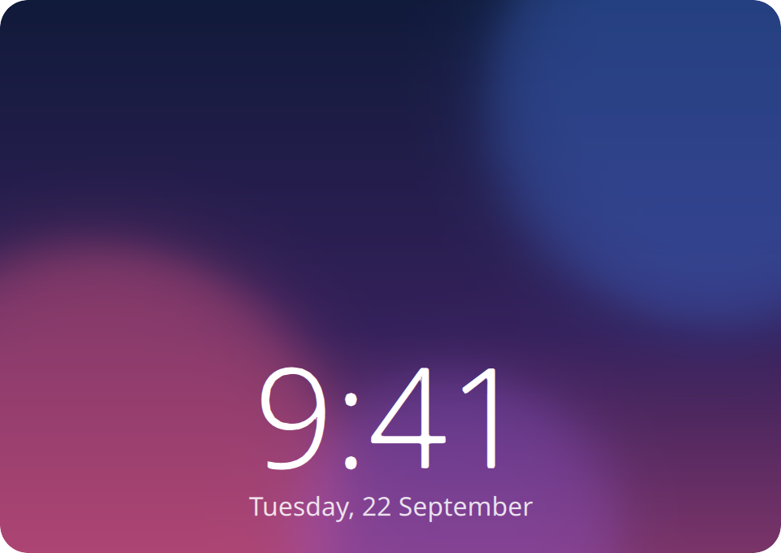
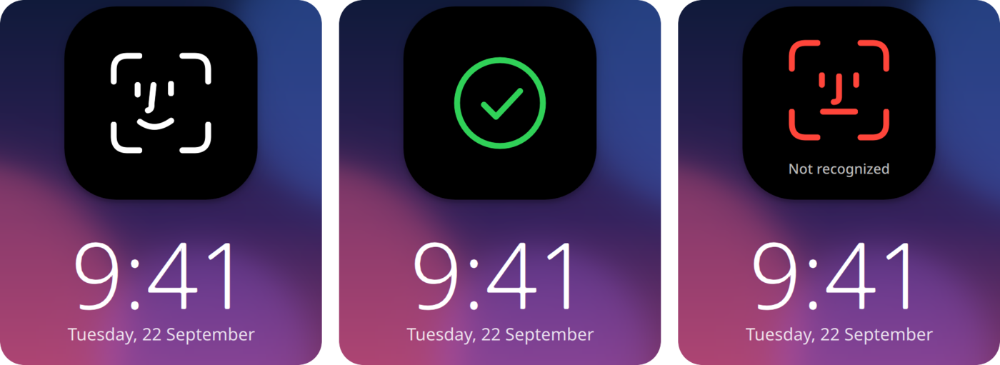
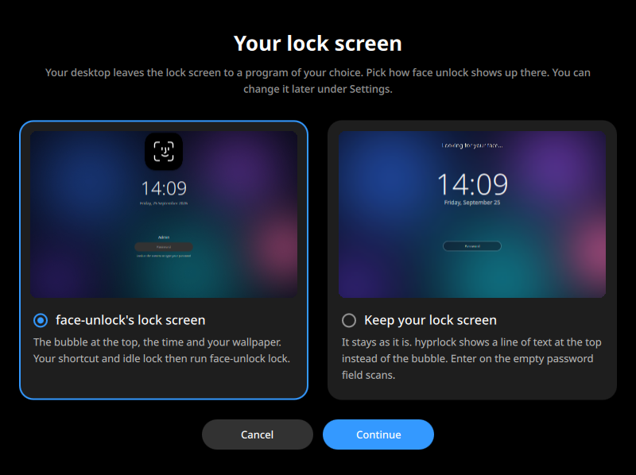
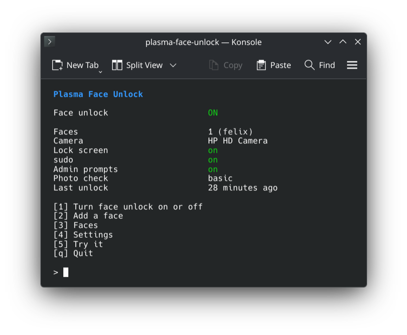
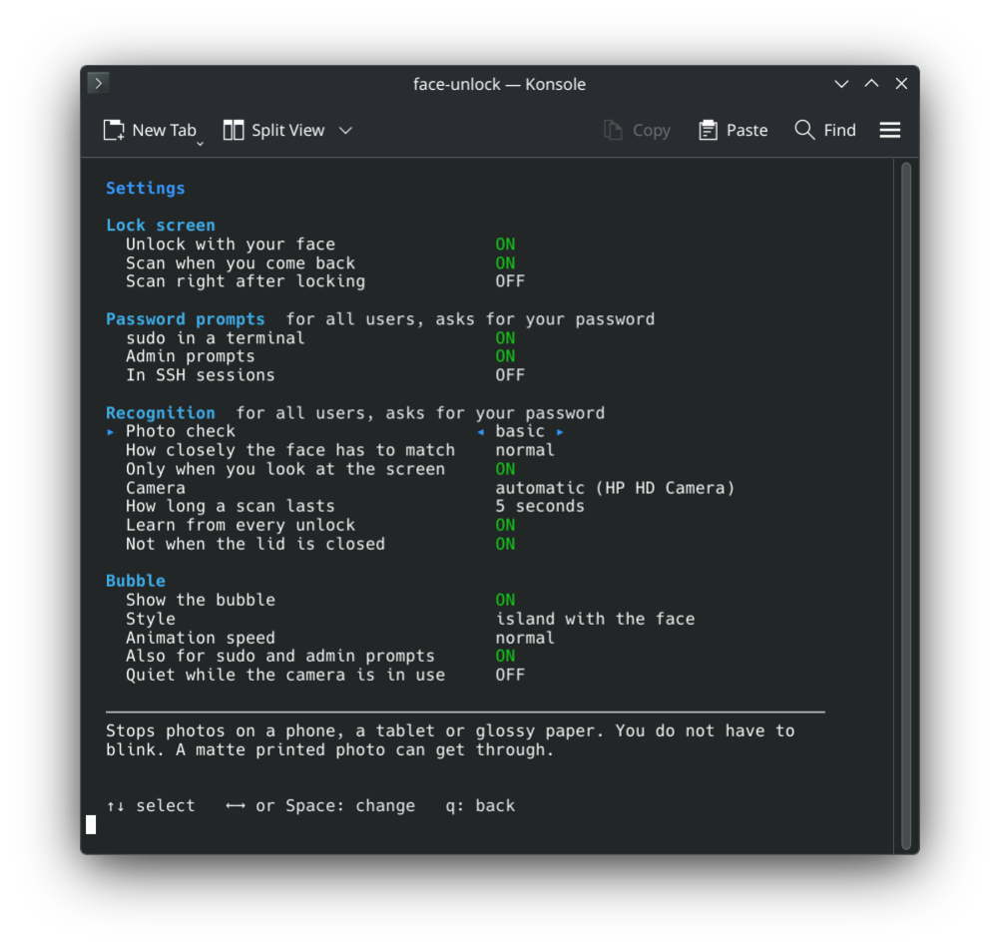
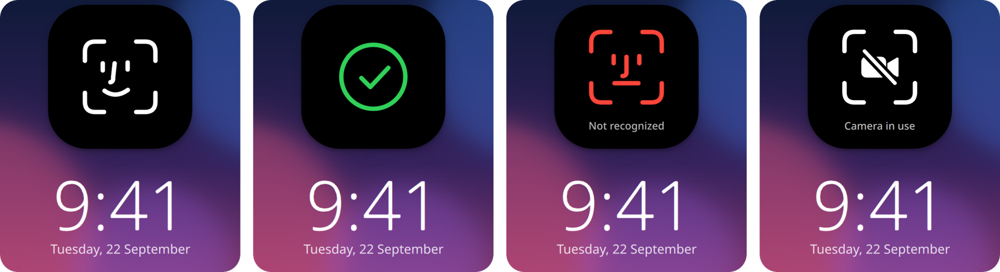
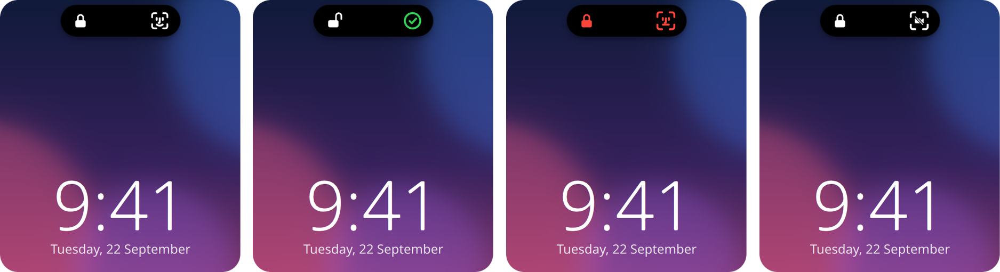

<p align="center">
  
</p>

<h1 align="center">face-unlock</h1>

<h3 align="center">Face ID for Linux.</h3>

<p align="center">
  Unlock the lock screen, sudo and admin prompts with your face.<br>
  On KDE Plasma, GNOME, Hyprland and Niri.
</p>

<h5 align="center">
  <a href="#install">Install</a> |
  <a href="#how-to-use">How to use</a> |
  <a href="#is-it-safe">Is it safe?</a> |
  <a href="https://github.com/LoonixTools/face-unlock/issues">Report a bug</a>
</h5>

<p align="center">
  <a href="https://ko-fi.com/felitendo"></a>
</p>

<p align="center">
  
</p>

<p align="center">
  
</p>

## Install

<details>
<summary><b>Arch</b>, CachyOS, EndeavourOS, Manjaro</summary>

```bash
yay -S face-unlock
```

</details>

<details>
<summary><b>Fedora</b></summary>

```bash
sudo curl -fsSL -o /etc/yum.repos.d/face-unlock.repo \
  https://loonixtools.github.io/face-unlock/face-unlock.repo
sudo dnf install face-unlock
```

</details>

<details>
<summary><b>Debian</b>, Ubuntu</summary>

```bash
codename="$(sed -n 's/^VERSION_CODENAME=//p' /etc/os-release)"
sudo install -d -m 0755 /etc/apt/keyrings
curl -fsSL https://loonixtools.github.io/face-unlock/KEY.gpg \
  | sudo gpg --dearmor -o /etc/apt/keyrings/face-unlock.gpg
echo "deb [signed-by=/etc/apt/keyrings/face-unlock.gpg] https://loonixtools.github.io/face-unlock/deb/$codename ./" \
  | sudo tee /etc/apt/sources.list.d/face-unlock.list
sudo apt update && sudo apt install face-unlock
```

</details>

- **KDE Plasma:** works out of the box.
- **GNOME:** log out and back in once after installing.
- **Hyprland and Niri:** the bubble only shows on face-unlock's own lock screen.
  hyprlock shows a line of text at the top instead. You also need a polkit
  agent. If none runs, the menu offers to install one.

<details>
<summary>Hyprland and Niri: which lock screen?</summary>

<p align="center">
  
</p>

When you turn face unlock on, a window asks which lock screen you want. You
can change it later under **Settings**.

- **face-unlock's own:** the bubble, the time and your wallpaper. You lock with
  `face-unlock lock`, and the menu shows where to put that.
- **Yours** (hyprlock, swaylock, gtklock or waylock): press Enter on the empty
  password field to scan. hyprlock and swaylock also scan when you come back.

Hyprland without uwsm needs a line in its config. The menu shows it.

</details>

## How to use

```bash
face-unlock
```

<p align="center">
  
</p>

Press **1** and look at the camera. Then lock the screen and look at it.

<details>
<summary>Settings</summary>

<p align="center">
  
</p>

</details>

<details>
<summary>All bubble states</summary>

<p align="center">
  
</p>

<p align="center">
  
</p>

</details>

## Is it safe?

It is a convenience upgrade, not extra security. Your webcam only sees a flat picture, so
it cannot always differentiate your face from a good fake. But the tool does everything in its power to prevent that:

- Photos and videos on a phone, tablet or glossy screen are caught.
- A matte printed photo is caught when the photo check is set to *strict*.

But a video of you on a big matte screen could get in.

After five failed attempts, face unlock pauses for 15 minutes. Your face is kept as
numbers, not pictures, and only root can read them. sudo over SSH asks for the
password, unless you turn that on.

## More

<details>
<summary>How it works</summary>

| | |
|---|---|
| `face-unlockd` | The root service. Owns the camera and the face data. |
| `face-unlock-agent` | Runs in your session. Watches the lock screen, draws the bubble. |
| `pam_face_unlock.so` | Lets sudo and admin prompts ask the service. |
| `face-unlock` | The menu. |

Two small networks from the OpenCV model zoo run on the CPU: YuNet finds the face, SFace turns it
into numbers. All details: `man face-unlock`.

</details>

<details>
<summary>Build from source</summary>

```bash
make models
make
make test
sudo make install
```

Needs CMake, a C++20 compiler, Qt 6, LayerShellQt, KI18n, OpenCV 4.5.4+ (with DNN), Linux-PAM and
libsystemd.

</details>

## Credits

- [Glance](https://github.com/jonnyoo/glance) by Jonathan Zhou: the idea and the look of the bubble.
- [YuNet](https://github.com/opencv/opencv_zoo/tree/main/models/face_detection_yunet) and
  [SFace](https://github.com/opencv/opencv_zoo/tree/main/models/face_recognition_sface) from the
  OpenCV model zoo.

GPL-3.0-or-later.
